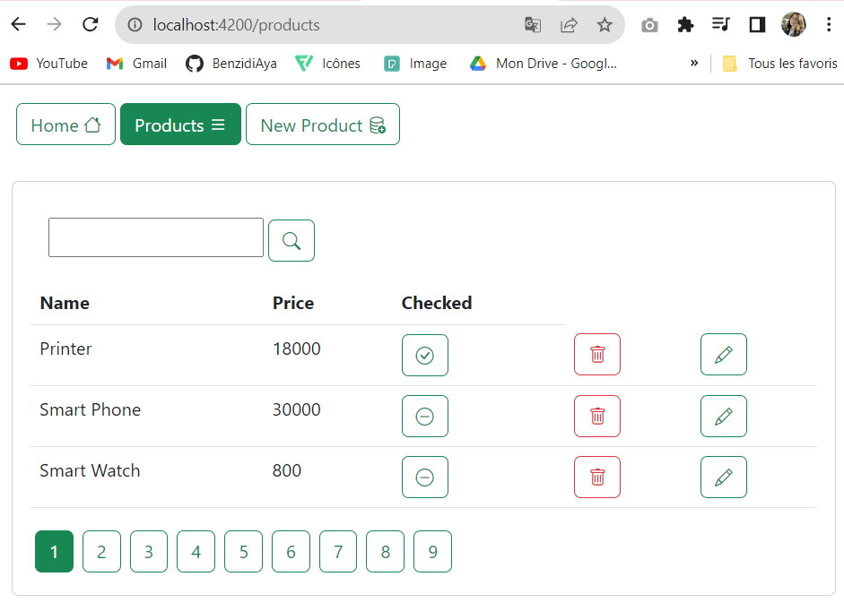
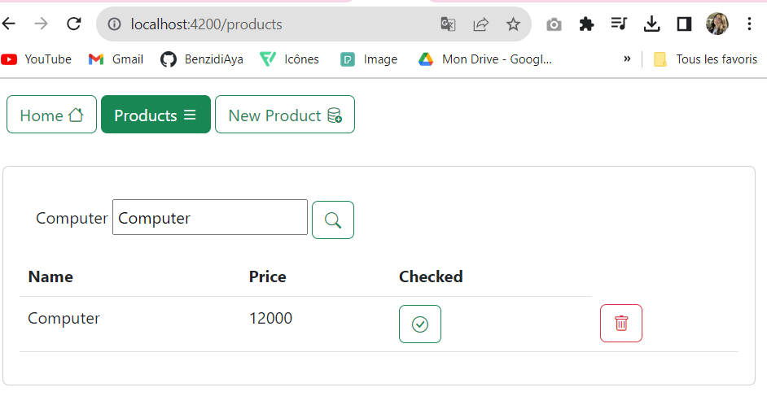
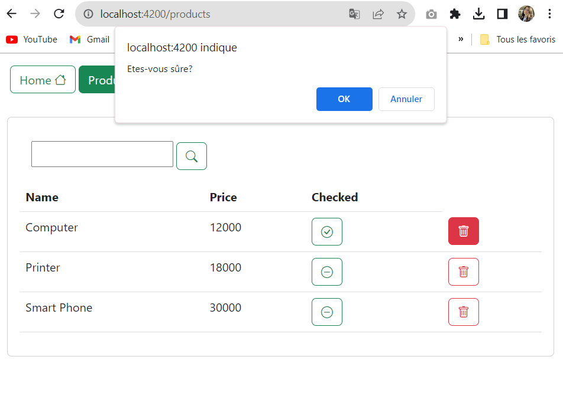
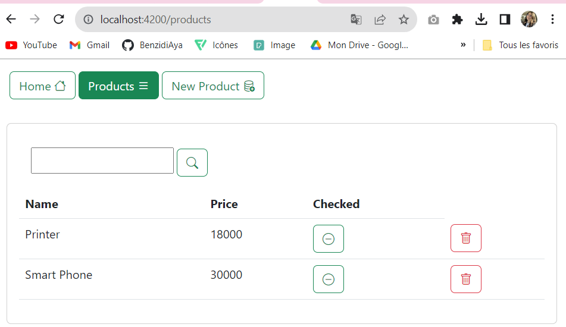
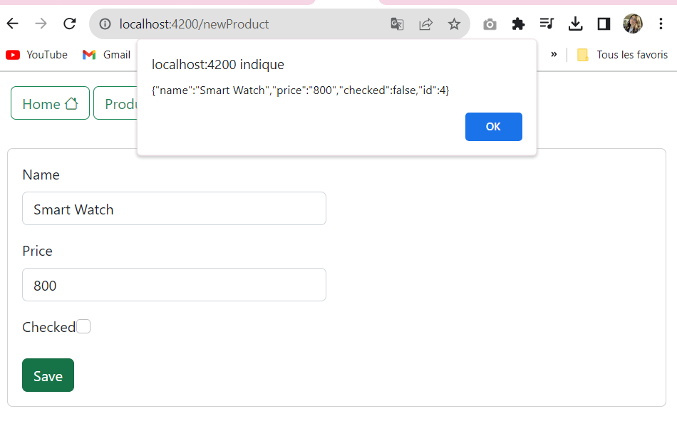
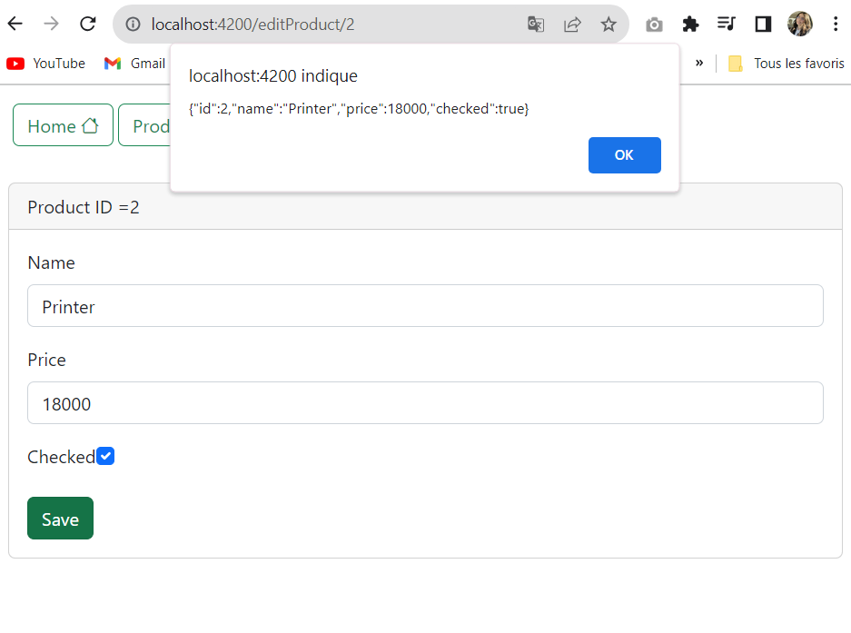
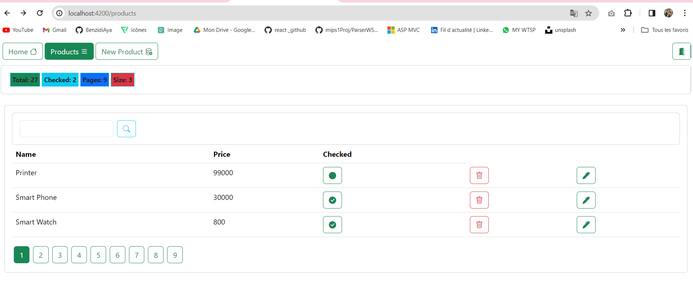

<h1 align="center">Angular-Demo-App</h1>

This Angular Demo App showcases a simple product management system. Users can view a list of products, search for products using keywords, delete products, and add new products through different components. The app utilizes various Angular features, including components, services, and interacts with a JSON server to manage product data.

 
 
<h4>Product List :</h4>

In the "products" component, users can view a list of available products.

 
<h4>Pagination :</h4>

 
<h4>Search Products using "Keyword" :</h4>

The app allows users to search for products by entering keywords. The search functionality is available in the product list.

 
<h4>Delete Product :</h4>

Users can delete a product from the list. A confirmation prompt ensures the user's intention before deleting.

 
<h4>Add new-product :</h4>

In the "new-product" component, users can add new products to the system.

 

 
<h4>Edit an Existing product :</h4>

 
<h4>Dash-board</h4>

